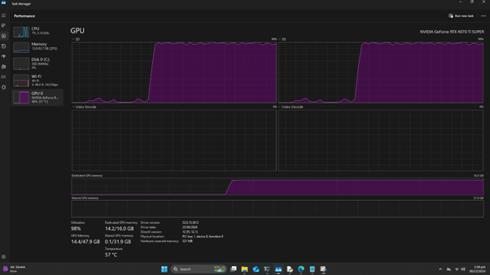
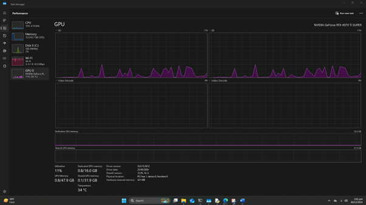
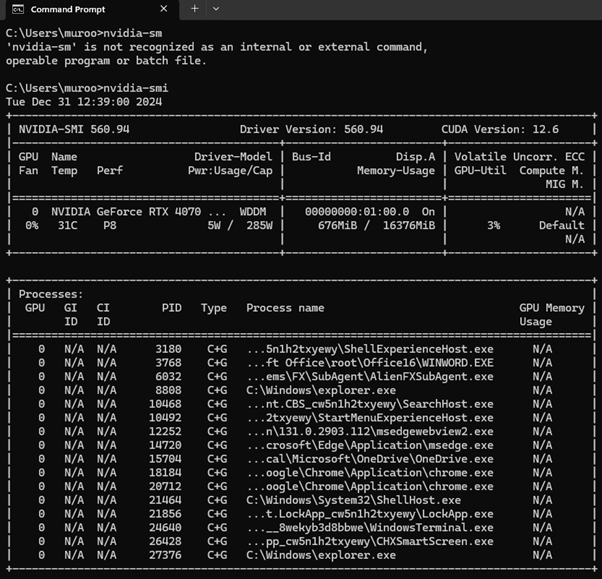
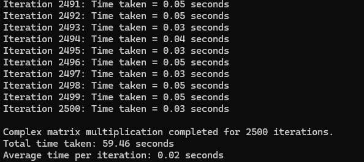
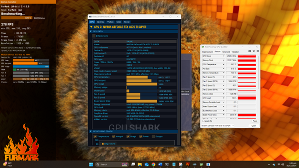

# NVIDIA 4070 Ti GPU Benchmark & Setup 🚀

[](https://www.python.org/)
[](https://www.tensorflow.org/)
[](https://pytorch.org/)
[](https://developer.nvidia.com/cuda-toolkit)

A complete **GPU setup and benchmarking workflow** for the **NVIDIA
GeForce RTX 4070 Ti**, featuring installation steps, environment
configuration, and a TensorFlow-based **complex matrix multiplication
benchmark**.

------------------------------------------------------------------------

## 📖 Table of Contents

1.  [Overview](#-overview)
2.  [Hardware & Software
    Requirements](#-hardware--software-requirements)
3.  [Setup Instructions](#-setup-instructions)
4.  [Benchmark Script](#-benchmark-script)
5.  [Sample Results](#-sample-results)
6.  [Project Structure](#-project-structure)
7.  [Contributing](#-contributing)
8.  [License](#-license)

------------------------------------------------------------------------

## 🔍 Overview

This repository demonstrates how to: - Configure a **Python
environment** with CUDA and cuDNN support.\
- Install **TensorFlow GPU** and **PyTorch GPU** for deep learning.\
- Run a **stress-test benchmark** using **large complex matrix
multiplications** on the NVIDIA 4070 Ti.

The benchmark measures GPU utilization by repeatedly multiplying large
complex matrices, providing both **total runtime** and **average
iteration time**.

------------------------------------------------------------------------

## ⚙️ Hardware & Software Requirements

-   **GPU**: NVIDIA GeForce RTX 4070 Ti\
-   **CUDA Toolkit**: 11.2\
-   **cuDNN**: 8.1\
-   **Python**: 3.8+\
-   **Conda**: Recommended for environment management

------------------------------------------------------------------------

## 🛠 Setup Instructions

Run the following commands step by step:

``` bash
# Create a dedicated conda environment
conda create --name jethexa python=3.8 -y
conda activate jethexa

# Install CUDA & cuDNN
conda install -c conda-forge cudatoolkit=11.2 cudnn=8.1 -y

# Install TensorFlow GPU
pip install tensorflow-gpu==2.10.1 
pip install keras==2.10.0

# Install PyTorch GPU (CUDA 11.8 compatible)
pip3 install torch torchvision torchaudio --index-url https://download.pytorch.org/whl/cu118

# Install NVIDIA CUDA compiler tools
conda install -c nvidia cuda-nvcc

# Optional: TensorFlow Addons
pip install tensorflow-addons
```

------------------------------------------------------------------------

## ⚡ Benchmark Script

The benchmark is implemented in [`gp.py`](gp.py).\
It performs **2500 iterations** of large-scale complex matrix
multiplications and prints iteration times.

### Run benchmark:

``` bash
python gp.py
```

### Script Highlights:

-   Detects GPU availability automatically.
-   Generates random **complex-valued matrices**.
-   Measures **per-iteration time** and **total runtime**.

Example snippet:

``` python
gpus = tf.config.list_physical_devices('GPU')
if not gpus:
    print("GPU is not available.")
else:
    print(f"Using GPU: {tf.test.gpu_device_name()}")
```

------------------------------------------------------------------------

## 📊 Sample Results

  Iteration   Time Taken (s)
  ----------- ----------------
  1           1.42
  2           1.39
  ...         ...
  2500        1.41

**Total Time:** \~3520 seconds\
**Average per Iteration:** \~1.41 seconds

🖼️ *Sample GPU Monitoring (replace with your screenshot):*\






------------------------------------------------------------------------

## 📂 Project Structure

    nvidia-4070ti-gpu-benchmark/
    │── gp.py                # Benchmark script
    │── gpu-setup.docx       # Detailed setup instructions
    │── README.md            # This file
    │── images/              # Screenshots, GPU monitoring graphs
                 
------------------------------------------------------------------------

## 🤝 Contributing

Contributions are welcome!\
- Open an issue for feature requests or bug reports.\
- Submit pull requests with improvements.

------------------------------------------------------------------------

## 📜 License

This project is licensed under the **MIT License**.\
See [LICENSE](LICENSE) for details.

------------------------------------------------------------------------
